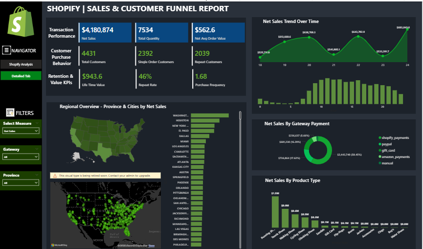
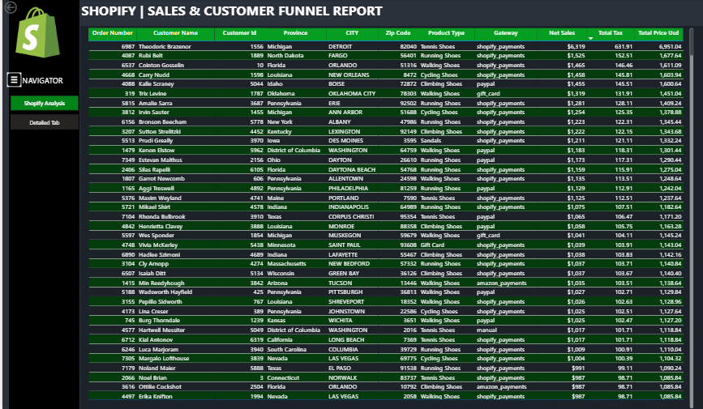

# 🛒 Shopify Sales & Customer Funnel Report (Power BI)

## 🔹 Overview

This project presents an **interactive Shopify Sales & Customer Funnel Dashboard** built using **Microsoft Power BI**.  
The dashboard analyzes transaction performance, customer purchasing behavior, retention metrics, and revenue distribution to provide **actionable e-commerce insights**.

The solution simulates a real-world **online retail analytics use case**, enabling stakeholders to monitor sales health, understand customer dynamics, and optimize business performance.

---

## 🎯 Business Objective

E-commerce businesses require continuous visibility into:

- Sales performance & revenue trends  
- Customer acquisition & retention behavior  
- Purchase patterns & order characteristics  
- Payment & product performance  

This dashboard helps decision-makers quickly identify **growth opportunities, revenue drivers, and customer value metrics**.

---

## 🛠 Tools & Technologies

- **Microsoft Power BI**
- **Power Query** – Data Cleaning & Transformation
- **DAX (Data Analysis Expressions)** – Measures & KPIs
- **Data Modeling & Relationships**
- **Interactive Visualizations**

---

## 📁 Dataset Summary

The dataset (simulated Shopify transactional data) includes:

- Order & Transaction Details  
- Customer Information  
- Product Categories  
- Payment Gateways  
- Net Sales & Taxes  
- Geographic Data (Province / City)  

---

## 📈 Key Dashboard Components

### ✅ Transaction Performance
- Net Sales  
- Total Quantity Sold  
- Average Order Value (AOV)  
- Sales Trend Over Time  

---

### ✅ Customer Purchase Behavior
- Total Customers  
- Single Order Customers  
- Repeat Customers  
- Repeat Rate  
- Purchase Frequency  

---

### ✅ Retention & Value Metrics
- Customer Lifetime Value (LTV)  
- Retention Indicators  
- Funnel-style customer breakdown  

---

### ✅ Revenue Distribution
- Net Sales by Payment Gateway  
- Net Sales by Product Type  
- Regional Sales Analysis  

---

## 🔍 Analytical Insights

✔ Sales trends reveal demand fluctuations across periods  
✔ Repeat customers contribute significantly to revenue stability  
✔ Certain product categories dominate sales performance  
✔ Payment gateway usage indicates transaction preferences  
✔ Geographic patterns highlight high-value regions  

---

## 💼 Business Impact

This dashboard supports:

- Sales Monitoring & Revenue Tracking  
- Customer Retention Analysis  
- Product Performance Evaluation  
- Marketing & Funnel Optimization  
- Regional Performance Assessment  

---

## 📷 Dashboard Preview

### **Shopify Analysis View**

---

### **Detailed Transaction View**

---

## 🔗 Power BI Service Report

👉 **Live Interactive Dashboard:**  
[Link](https://app.powerbi.com/groups/me/reports/43768f14-3096-4682-bfb3-5e0c9b3fa7e9/849b0408fa61823a3bc3?experience=power-bi)

---

## 🚀 Potential Business Actions

- Focus marketing efforts on high-retention customer segments  
- Optimize pricing & promotions for top-performing products  
- Improve conversion strategies for single-purchase customers  
- Evaluate payment gateway performance & fees  
- Target high-revenue regions for expansion  

---

## 👤 Author

**Durga Kandi**  
Data Analyst | Power BI Developer

---

## ⭐ If you found this project useful, consider giving it a star!
